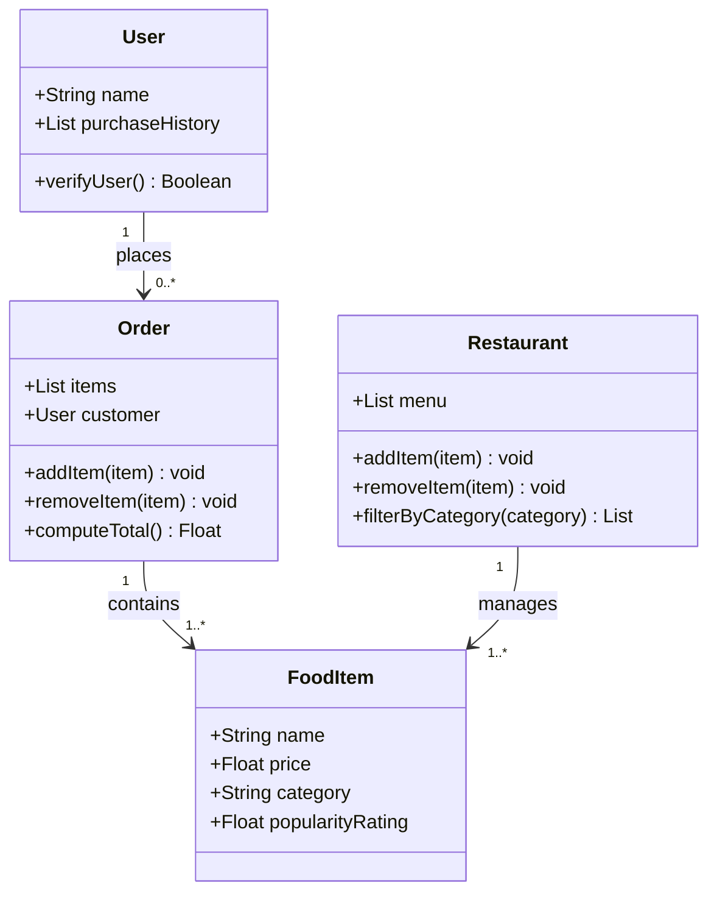

# ByteBites UML Class Diagram

```mermaid
classDiagram

    class User {
        +String name
        +List purchaseHistory
        +verifyUser() Boolean
    }

    class FoodItem {
        +String name
        +Float price
        +String category
        +Float popularityRating
    }

    class Restaurant {
        +List menu
        +addItem(item) void
        +removeItem(item) void
        +filterByCategory(category) List
    }

    class Order {
        +List items
        +User customer
        +addItem(item) void
        +removeItem(item) void
        +computeTotal() Float
    }

    User "1" --> "0..*" Order : places
    Order "1" --> "1..*" FoodItem : contains
    Restaurant "1" --> "1..*" FoodItem : manages
```
